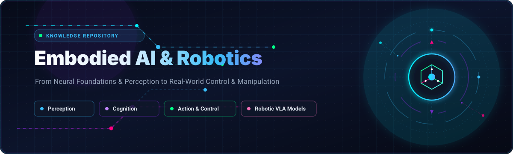

  

  
  
  
  
  
  
  

# 🤖 Embodied AI and Robotics Tutorial

✨ Welcome to the **Embodied AI and Robotics Tutorial**! This comprehensive guide is designed to introduce you to the fascinating intersection of artificial intelligence and physical systems. Over the course of these chapters, you will learn the fundamental concepts, practical techniques, and cutting-edge applications that enable intelligent agents to perceive, reason, and act in the real world. 🌍🦾

Whether you are a student 🎓, researcher 🔬, or robotics enthusiast 🚀, this tutorial will provide you with a solid foundation to understand and build your own embodied AI systems.

---

## 📚 Table of Contents

- 🚀 [Introduction to Embodied AI & Robotics](Introduction_to_Embodied_AI_Robotics/index.md)
- 🧠 [Foundational Concepts](Foundational_Concepts/index.md)
- 👁️ [Perception for Embodied AI](Perception_for_Embodied_AI/index.md)
- 🦾 [Action and Control](Action_and_Control/index.md)
- 🔮 [Advanced Topics & Future Directions](Advanced_Topics_and_Future_Directions/index.md)

---

## 🌟 Star History

